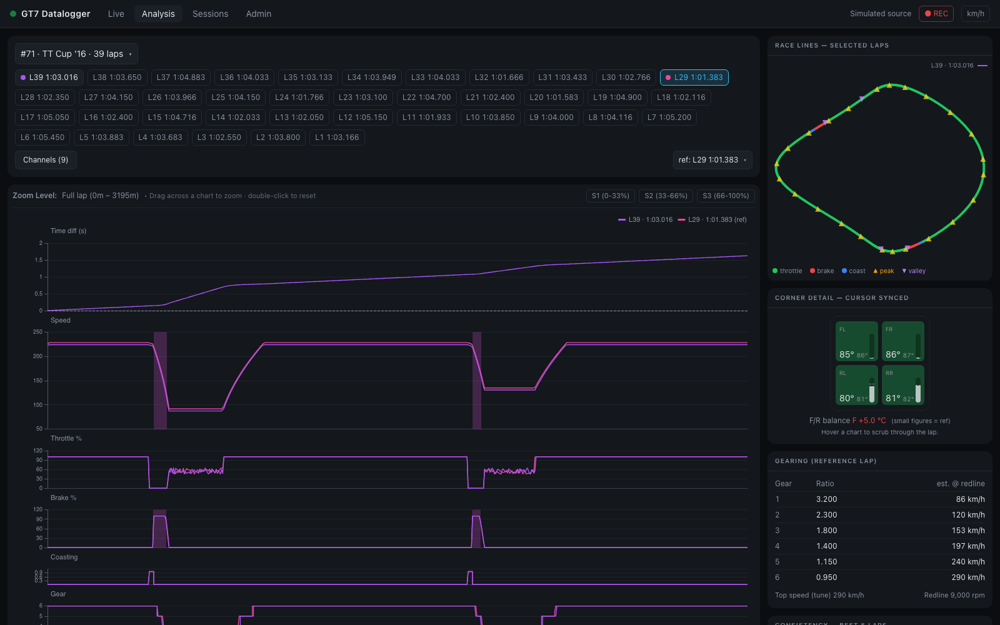

# Analysis view

`#/analysis` — overlay any number of laps against a reference lap and find where the
time goes. The x-axis everywhere is **distance into the lap**, so laps of different
speeds line up corner-for-corner (see [Lap comparison math](../internals/analysis-math.md)).

## Selecting laps

1. Pick a **session** from the dropdown (`#id · car · n laps`). The newest session with
   laps is selected by default.
2. **Click lap chips** to toggle them into the comparison.
3. **Double-click a chip** (or use the `ref:` dropdown) to make it the **reference
   lap** — the lap everything else is measured against.

Until you pick manually, the view auto-selects *latest vs best* and keeps following as
new laps arrive live — useful on a second screen while driving. Any manual change pins
your selection.

!!! tip "Deep links"
    The full selection is encoded in the URL —
    `#/analysis?session=3&laps=12,15&ref=15&ch=speed,brake` — so a bookmark or shared
    link reproduces the exact view. The Sessions and Live views use these links for
    their *compare* / *analyze* shortcuts.

## Stacked charts

The first panel is always **Time diff (s)** — each lap's gap to the reference over
distance (positive = slower; where the curve climbs is where you lose time). Below it,
one panel per selected channel.

- **Synced cursors** — hover any panel and a crosshair appears at the same distance in
  every panel, on the race line map, and in the Corner Detail widget. The tooltip shows
  one column per lap, unit-formatted.
- **Zoom** — drag across any chart to zoom a section; every panel, the map, and the
  deviation chart crop to it. Double-click to reset, or use the **S1 / S2 / S3** buttons
  to jump to thirds of the lap. (Mouse-wheel zoom is off on purpose so page scrolling
  stays normal.)
- **Event shading** — detected [chassis events](../internals/event-detection.md) shade
  the panel that explains them: lockups on Brake, wheelspin on Throttle,
  bottoming/kerbs on suspension panels; TCS activity shades Throttle, ASM shades Speed.
  Bands are tinted in the lap's color.

## Channel picker

The **Channels (n)** button opens a grouped picker with ~20 channels:

| Group | Channels |
| --- | --- |
| Driving | Speed, Throttle, Brake, Coasting, Gear, Yaw rate |
| Engine | RPM, Boost |
| Tires & wheels | Tire spd/car spd, slip front/rear avg, slip per wheel, tire temp front/rear avg, **tire temp F−R balance** |
| Chassis | Ride height, susp travel front/rear avg |

Your selection persists in the browser and is added to the URL when it differs from the
default nine-panel stack. Laps recorded before a channel existed simply skip that line.

## Race line map

A top-down plot of the reference lap's driven line, colored by input zone — green =
throttle, red = braking, blue = coasting — with ▲ speed peaks and ▼ valleys marked.
Other selected laps overlay as colored lines. The map has no direct mouse interaction:
it follows the chart cursor, placing one dot per lap at the hovered distance so you can
see the spatial gap between lines, and it auto-crops when you zoom a section.

## Corner Detail widget

A top-down car with four corner cells that replays the load-transfer story as you scrub
the charts:

- **cell color** = that wheel's tire temp (blue < 55 °C, green 55–95 °C, red ≥ 95 °C)
- **bars** = suspension compression, normalized to that lap's travel range
- **LOCK / SPIN badges** using the live thresholds (brake ≥ 20 % & slip < 0.9;
  throttle ≥ 40 % & slip > 1.1)
- **F/R temp balance** readout at the bottom

One lap is in focus at a time; the reference lap is always the *ghost* — small secondary
temps and dashed suspension levels — and a cell gets a red/blue ring when the focus lap
runs more than 3 °C hotter/cooler than the reference at that point. With 3+ compared
laps, focus chips let you switch the focus lap.

## Side panels

- **Gearing (reference lap)** — per-gear ratios with estimated speed at redline, tune
  top speed, and redline RPM.
- **Consistency — best 5 laps** — median speed plus a deviation band across the
  session's best laps; a wide band marks corners you drive differently every lap.
- **Fuel strategy** — the relative [fuel-map table](../internals/fuel-strategy.md):
  for each setting −5…+5 vs the reference lap's, projected fuel/lap, laps remaining,
  time remaining, and lap-time cost.
- **Tuning info (reference lap)** — max speed, min ride height, input percentages, tire
  spin, fuel used, aid usage (TCS/ASM %), engine health (max water/oil temp, min oil
  pressure), and the detected-event summary.
