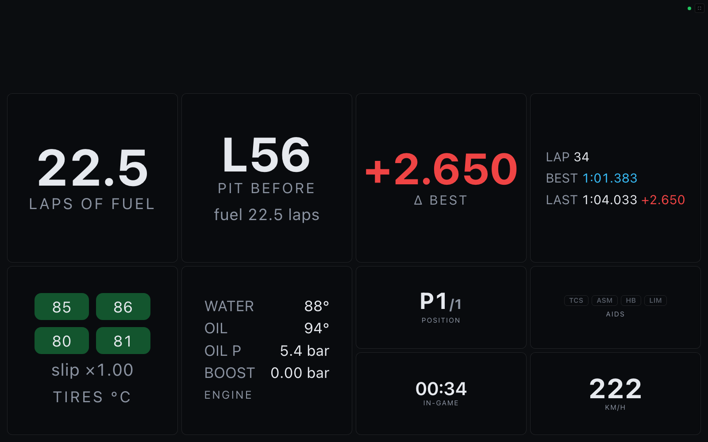

# Driver dashboard

**`/dash`** is a full-screen race-engineer screen for a second display (or a tablet on
the wheel stand) while you drive. It uses the same widget grid as the
[overlay](overlay.md), tuned for glanceability: dark page, big numbers, and a
**warning banner row** that stays empty until something needs attention.

```
http://<host>:8000/dash                      # built-in Race engineer preset
http://<host>:8000/dash?preset=endurance     # built-in Endurance preset
http://<host>:8000/dash?layout=my-dash       # a layout you saved in the builder
http://<host>:8000/dash?demo=1               # placeholder data for a dry run
```

A tiny status dot sits top-right (green = live telemetry, amber = placeholder, red =
waiting), next to a **⛶ fullscreen** toggle.



## Built-in presets

- **Race engineer** (default) — alerts banner across the top; fuel laps remaining,
  pit-window countdown, live Δ-to-best, and lap times in the middle; tire temps + slip,
  detailed engine health, position, clock, driver-aid badges, and speed below.
- **Endurance** — fuel is the hero readout, with a wide engine-health panel, fuel
  summary, clock, position, and lap times.

To customize one, open **Admin → Overlay & dashboard builder**, start from a dash
preset, rearrange/restyle the widgets, and save it under a name — then open
`/dash?layout=<name>` on the driver screen. Saved dash layouts always render
full-screen on a dark page, whatever canvas the builder showed.

## Race alerts

The `alerts` widget turns telemetry into race-engineer callouts, sorted most-critical
first. Critical banners pulse red; warnings are amber; info is blue.

| Alert | Fires when |
| --- | --- |
| `FUEL n LAPS` | projected fuel < 3 laps (warning) / < 1.5 laps (critical, pulsing) |
| `PIT THIS / NEXT LAP` | the projected pit lap is upon you (lapped races only) |
| `Water n °C` | > 110 °C warning · > 120 °C critical |
| `Oil n °C` | > 130 °C warning · > 140 °C critical |
| `OIL PRESSURE` | < 2.0 bar with the engine above 2000 rpm (critical) |
| `Tires hot` | any tire > 110 °C |

Fuel projections use the rolling 3-lap average, the same numbers as the strategy
widget. Alerts are suppressed while off-track or paused, so menus don't scream at you.
The engine and tire widgets color their readouts with the same thresholds.
