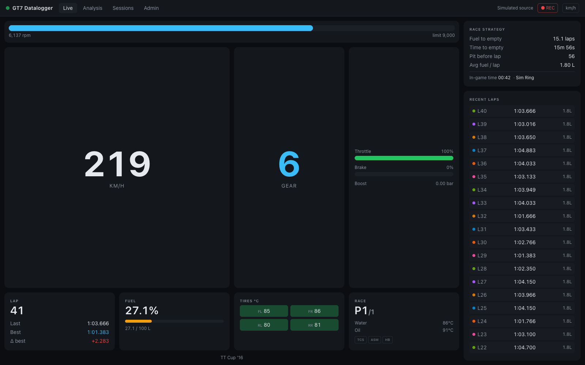

# Live view

`#/live` — the default view. Big race readouts that update continuously from the
telemetry stream while you drive.

## Panels

**RPM bar** — fills toward the shift point (`rpm ÷ redline`). It turns red at ≥ 95 % of
the redline or when the rev limiter engages, and pulses while you're actually on the
limiter.

**Speed** — converted to your units setting (toggle km/h ↔ mph in the status bar).

**Gear** — `R` for reverse, `N` for neutral. When the game suggests a downshift, a
`gear → N` hint appears under the number.

**Inputs** — throttle (green) and brake (red) bars with percentages. A boost row
(`x.xx bar`) appears automatically on turbocharged cars.

**Lap panel** — current lap (with `/total` in races, or `FIN` after the flag), last lap,
best lap, and **Δ best** — your last lap compared against the best *before* it, so a new
personal best shows the actual improvement (green ≤ 0, red if slower).

**Fuel** — percentage of tank with a bar that turns red below 15 %, plus liters
remaining / capacity.

**Tires °C** — the four tire temperatures in a 2×2 layout, tinted by temperature:
blue below 55 °C (cold), green 55–95 °C (optimal), red at 95 °C and above (hot). A
`TIRE SPIN` warning flashes when average slip exceeds 1.1×.

**Race panel** — position (`P3/16`), water and oil temperature with warning colors for
long stints (water: amber ≥ 100 °C, red ≥ 110 °C; oil: amber ≥ 115 °C, red ≥ 130 °C),
and three **driver-aid pills** — `TCS`, `ASM`, `HB` — that light amber while that aid is
actively intervening.

The footer shows the car name, plus `PAUSED` / `not on track` states.

## Race strategy panel

On larger screens the right column projects your fuel strategy from a rolling average of
the last 3 fuel-consuming laps:

- **Fuel to empty** — laps left at current consumption (amber < 4 laps, red < 2)
- **Time to empty** — the same, in time
- **Pit before lap** — the last lap you can complete on this tank
- **To finish** — in races with a known length: green *fuel OK*, or red *x.x L short*
- **Avg fuel / lap** and the **in-game clock** (handy for endurance day/night cycles)

The panel stays empty until you complete a lap that actually consumed fuel — see
[Fuel & race strategy](../internals/fuel-strategy.md) for the math.

## Recent laps feed

Every completed lap appears in the feed (newest first) with its color dot, lap number,
time, and fuel used. **Click any lap to open it in the Analysis view** with that session
and lap pre-selected.

## Status bar (all views)

- **Status dot** — green pulsing: receiving telemetry; amber: server up but no
  telemetry (check console IP / UDP 33740); red: browser lost the server.
- **● REC / ○ Paused** — toggle lap recording on/off.
- **km/h / mph** — units toggle, persisted in the browser.

## Empty state

Before any telemetry arrives, the view shows *"Waiting for telemetry…"*. Start driving
in GT7, or run the server with `GT7_SOURCE=sim` to demo without a console.
