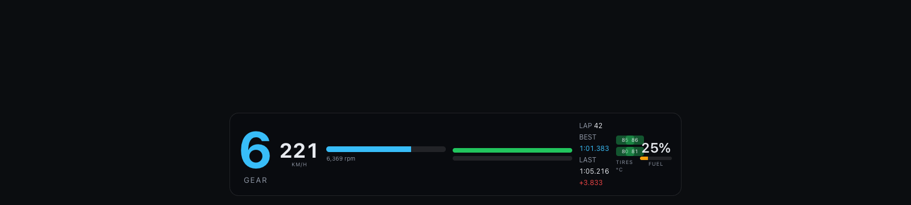
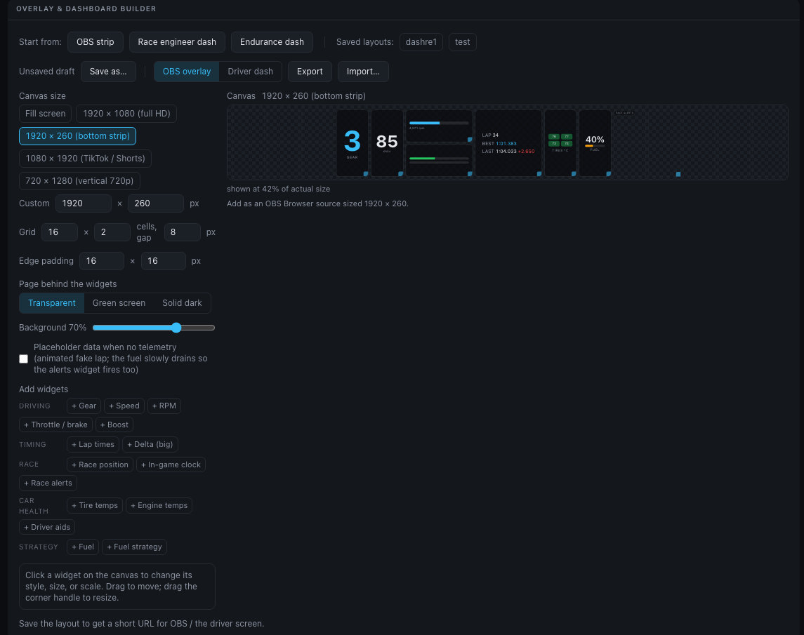

# Overlay & streaming

The overlay is a standalone, chrome-less telemetry page at **`/overlay`** designed to be
added as an **OBS Browser source**, opened in TikTok LIVE Studio, or loaded on a phone /
pit-wall tablet.

Layouts are built on a **free-placement grid**: drag any mix of widgets onto a snapping
canvas, size each one from 1×1 up to 4×4 cells, and pick a **visual style per widget**
(digits, bar, gauge, shift lights, …). Named layouts are **saved on the server**, so OBS
gets a short, stable URL — edit the layout later and every browser source updates
without touching OBS again:

```
http://<host>:8000/overlay?layout=race-strip
```



## Building a layout



Open **Admin → Overlay & dashboard builder**. One-click starting points:

- **OBS strip** — transparent 1920×260 bottom strip
- **Race engineer dash** / **Endurance dash** — full-screen [driver dashboards](dash.md)

Then work directly on the canvas:

- **Drag** a widget to move it — the ghost outline snaps to the grid and turns red on a
  collision.
- **Drag the corner handle** to step through the widget's allowed footprints (1×1, 1×2,
  2×2, 4×4, …, depending on the widget).
- **Click** a widget to open its inspector: visual **style**, **size**, **fine scale**
  (50–200 %), or remove it.
- **Add widgets** from the grouped palette (driving / timing / race / car health /
  strategy); the same widget can appear more than once with different styles.

Canvas options:

- **Canvas size** — *Fill screen*, or exact-pixel presets: 1920×1080, 1920×260 strip,
  1080×1920 (TikTok / Shorts), 720×1280, or any custom size. The overlay renders at
  exactly those pixels.
- **Grid** — columns × rows (up to 24×24) and the gap between cells.
- **Page behind the widgets** — *Transparent* (OBS Browser sources with alpha), *Green
  screen* (#00FF00 — chroma-key it in apps without alpha support), or *Solid dark*
  (phones/tablets).
- **Background** — card opacity (0 = bare floating widgets), edge padding.

**Saving** — *Save as…* stores the layout on the server under a name; the name becomes
part of the URL (`/overlay?layout=<name>`). Rename, delete, and *Save copy* are one
click away, and the builder lists every saved layout for quick switching. Layouts can
also be exported/imported as JSON files — old URL-style overlay configs import too and
are converted to grid layouts automatically. Presets saved by the previous builder
version are detected on first visit and can be imported in bulk.

## Widgets & styles

| Widget | Styles |
| --- | --- |
| `gear` | digit + suggested-gear hint · digit only |
| `speed` | digits · bar · arc gauge |
| `rpm` | bar with `SHIFT` cue · shift-light LED strip · gauge · digits |
| `inputs` | horizontal throttle/brake bars · vertical bars |
| `times` | lap / best / last list · last lap (big) · best lap (big) |
| `delta` | live Δ vs the session-best lap (big number · centered ± bar) |
| `position` | big `P n/total` · compact |
| `tires` | 2×2 color-coded temps · temps + slip indicator |
| `fuel` | percent · bar · laps remaining |
| `strategy` | fuel summary · pit-window countdown |
| `clock` | in-game time of day |
| `engine` | water/oil temps · detailed (+ oil pressure, boost) |
| `aids` | TCS / ASM / handbrake / rev-limiter badges |
| `boost` | digits · gauge |
| `alerts` | stacked warning banners · compact list (see [driver dashboard](dash.md)) |

The `alerts` widget renders nothing while all is well, so it stays invisible in OBS
until a warning actually fires.

Full details for every widget — color thresholds, alert triggers, and behavior in
each track condition — are in the [widget reference](widgets.md).

## Setting up OBS

1. Build and **save** your layout, then copy the *Other devices* URL.
2. In OBS: **Sources → + → Browser**, paste the URL.
3. Set the source's width/height to **the same canvas size** you picked in the builder.
4. Done — the transparent page mode gives you clean alpha compositing. If your app
   renders transparent pages as black, switch to *Green screen* and add a chroma-key
   filter for `#00FF00`.

If the stream drops, the overlay renders nothing (an empty source, not a frozen box)
until telemetry resumes.

## Placeholder mode

The **placeholder data** checkbox (or `demo=1` on any overlay/dash URL) shows an
animated fake lap **only while no real telemetry is arriving**, with a small amber
*placeholder* tag. The fake lap's fuel slowly drains so the strategy and alert widgets
get exercised too. The moment real data resumes it switches back automatically — safe
to leave on.

## Legacy URL parameters

Overlay URLs from earlier versions keep working unchanged — the whole config lives in
the URL instead of on the server:

```
http://<host>:8000/overlay?w=gear:1.25,speed,rpm,times&layout=strip&size=1920x260&bg=70&align=bottom
```

| Param | Values | Default |
| --- | --- | --- |
| `w` | comma list of widget ids, each optionally `id:scale` (0.5–3) | `gear,speed,rpm,inputs,times,tires,fuel` |
| `layout` | `strip` · `stack` · `grid` | `strip` |
| `scale` | 0.5–2 global zoom | `1` |
| `bg` | card opacity 0–100 | `70` |
| `align` | `top` · `center` · `bottom` (strip/stack) | `bottom` |
| `size` | `WxH` exact pixels | fill source |
| `pad` | `XxY` edge inset px | `16x16` |
| `page` | `transparent` · `green` · `dark` | `transparent` (`dark` for grid) |
| `demo` | `1` for placeholder data | off |

These render through the original strip/stack/grid flow, pixel-identical to before.
`?layout=` with anything other than `strip`/`stack`/`grid` refers to a saved server
layout by name or id.
