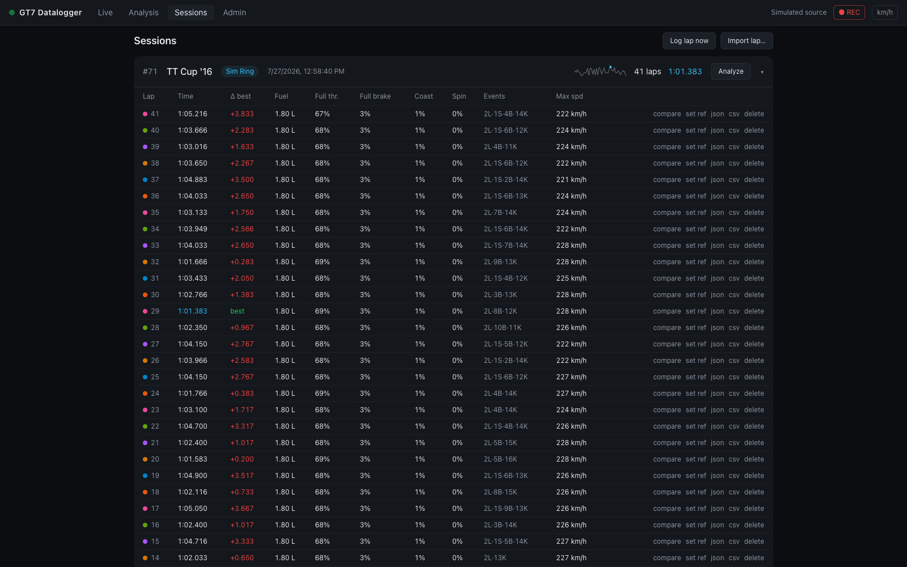

# Sessions view

`#/sessions` — your lap archive. Sessions are created automatically (split on car change
or race restart — see [Lap detection & sessions](../internals/lap-detection.md)) and
listed newest first.

## Session rows

Each row shows the session id, car, start time, lap count, best lap, a **lap-time
sparkline** (chronological lap times with the best lap dotted in accent), and the track:

- a track **badge** when the track is known;
- a dashed **name track…** button when it isn't. Naming it fingerprints the circuit from
  the session's first lap, and **every future session on that track is tagged
  automatically** — see [Track identification](../internals/track-identification.md).

Click a row (or the chevron) to expand its lap table; **Analyze** opens the session in
Analysis with *latest vs best* selected.

## Lap table

Per lap: time (best in accent), Δ to session best, fuel used, full-throttle %,
full-brake %, coasting %, tire-spin %, events, and max speed.

The **Events** column is a compact code — `2L·1S·3B·1K` means 2 lockups, 1 wheelspin,
3 suspension bottomings, 1 kerb strike; `–` means a clean lap.

Row actions:

| Action | What it does |
| --- | --- |
| **compare** | opens Analysis with this lap vs the session's best (best as reference) |
| **set ref** | opens Analysis with this lap as the reference |
| **json** | downloads the full 60 Hz recording, shareable and re-importable |
| **csv** | downloads the same lap as a **MoTeC-compatible CSV** for MoTeC i2 or Excel |
| **delete** | removes the lap and its telemetry (confirmed, irreversible) |

JSON and CSV lap files share the metadata-rich base name
`<LapID>-Session-<SessionID>-<date-time>-<car>-<track>-Lap-<race-lap-number>`.
For example, lap 4 may download as
`42-Session-8-2026-08-10_14-38-12-Porsche-911-GT3-Laguna-Seca-Lap-4.json`.

**Delete session** at the bottom of an expanded session removes the session and all its
laps.

## Header actions

- **Log lap now** — saves the in-progress lap immediately without waiting for the start
  line. Handy for capturing a partial run or a test.
- **Import lap…** — load a `.json` lap file exported from any GT7 Datalogger instance.
  Older v1 files import cleanly; the newer per-corner channels are simply absent and
  the charts skip them. Events and aid metrics are recomputed from the samples on
  import.
- **Export for LLM** — download one token-efficient whole-session analysis file. It uses
  fixed-distance timing, common reference-lap corners, event context, and bounded detail
  traces rather than concatenating every lap's 60 Hz samples. See the
  [LLM session export schema](../reference/llm-session-export.md). Its filename is
  `<SessionID>-<date-time>-<car>-<track>-<lap-count>-Laps-llm.json`.

Export timestamps use the machine running GT7 Datalogger's local time. Car and track
names are converted to filesystem-safe, hyphen-separated components; missing metadata
uses an explicit `Unknown-*` component. A missing lap finish time falls back to the
session start; if neither timestamp is usable, the filename uses `Unknown-Date-Time`.

## Recording control

The **● REC / ○ Paused** toggle in the status bar pauses lap recording globally — the
live view keeps streaming, but nothing is written to the database until you resume.

See [Lap file format](../reference/lap-file-format.md) for what's inside the JSON and
CSV exports.
